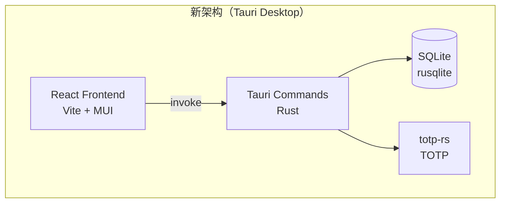

# Simple 2FA → Tauri 桌面应用重写

将现有的 **FastAPI + React** Web 应用重写为 **Tauri 2 (Rust + React)** 轻量桌面应用。前端 React 代码大部分复用，后端逻辑从 Python 迁移到 Rust。

**MCP 服务器不再保留**，桌面版不需要。

## User Review Required

> [!WARNING]
> **QR 码扫描功能变化**：原 Web 版使用 `getDisplayMedia()` API。Tauri 中此 API 不可用，先保留手动输入模式，后续可集成截屏方案。

---

## 架构变化



---

## Proposed Changes

### 0. 前置步骤

#### [NEW] CLAUDE.md — 开发规范

在项目根目录创建 `CLAUDE.md`，规范 Tauri 重写的开发规则（代码风格、测试要求、提交规范等）。

#### Git 分支

从 `main` 创建 `feature/tauri-desktop` 分支，所有改动在此分支进行。

---

### 1. 项目初始化

#### [NEW] `src-tauri/` 目录（Tauri Rust 后端）

在 `frontend_react/` 下初始化 Tauri，生成 `src-tauri/` 目录：

```bash
cd frontend_react
bun add -D @tauri-apps/cli
bunx tauri init
```

初始化配置：
- App name: `Simple 2FA`
- Window title: `Simple 2FA Authenticator`
- Dev server URL: `http://localhost:5173`
- Frontend dist: `../dist`

---

### 2. Rust 后端（`src-tauri/src/`）

#### [NEW] [Cargo.toml](file:///home/niko/hobby/simple_2fa/frontend_react/src-tauri/Cargo.toml)

关键依赖：
- `tauri` — Tauri 框架核心
- `rusqlite` (features: `bundled`) — SQLite 数据库
- `totp-rs` (features: `otpauth`, `serde`) — TOTP 生成与验证
- `serde` + `serde_json` — 序列化
- `base32` — Base32 编解码
- `thiserror` — 错误处理

#### [NEW] [db.rs](file:///home/niko/hobby/simple_2fa/frontend_react/src-tauri/src/db.rs)

SQLite 数据库层，对应原 `backend/app/database.py` + `backend/app/api/models.py`：

```rust
// 数据模型
pub struct Account {
    pub id: i64,
    pub name: String,
    pub issuer: Option<String>,
    pub secret: String,
}

pub struct AccountWithCode {
    pub id: i64,
    pub name: String,
    pub issuer: Option<String>,
    pub code: String,
    pub ttl: u64,
}

// 数据库操作
pub fn init_db(app_data_dir: &Path) -> Result<Connection>
pub fn list_accounts(conn: &Connection) -> Result<Vec<Account>>
pub fn create_account(conn: &Connection, name, issuer, secret) -> Result<Account>
pub fn update_account(conn: &Connection, id, name?, issuer?, secret?) -> Result<Account>
pub fn delete_account(conn: &Connection, id) -> Result<()>
```

#### [NEW] [totp.rs](file:///home/niko/hobby/simple_2fa/frontend_react/src-tauri/src/totp.rs)

TOTP 核心逻辑，对应原 `backend/app/core/totp.py`：

```rust
pub fn normalize_secret(secret: &str) -> Result<String>
pub fn generate_totp(secret: &str) -> Result<String>
pub fn get_ttl(secret: &str) -> Result<u64>
pub fn validate_secret(secret: &str) -> Result<bool>
```

#### [NEW] [commands.rs](file:///home/niko/hobby/simple_2fa/frontend_react/src-tauri/src/commands.rs)

Tauri Commands，对应原 `backend/app/api/routes.py`：

```rust
#[tauri::command]
fn get_accounts(state: State<AppState>) -> Result<Vec<AccountWithCode>, String>

#[tauri::command]
fn add_account(state: State<AppState>, name, issuer, secret) -> Result<AccountRead, String>

#[tauri::command]
fn update_account(state: State<AppState>, id, name?, issuer?, secret?) -> Result<AccountRead, String>

#[tauri::command]
fn delete_account(state: State<AppState>, id) -> Result<(), String>
```

#### [NEW] [lib.rs](file:///home/niko/hobby/simple_2fa/frontend_react/src-tauri/src/lib.rs)

Tauri 应用入口，注册 commands 和管理状态：

```rust
pub struct AppState {
    pub db: Mutex<Connection>,
}

pub fn run() {
    tauri::Builder::default()
        .manage(AppState { db: Mutex::new(conn) })
        .invoke_handler(tauri::generate_handler![
            get_accounts, add_account, update_account, delete_account
        ])
        .run(tauri::generate_context!())
}
```

---

### 3. 前端适配

#### [MODIFY] [package.json](file:///home/niko/hobby/simple_2fa/frontend_react/package.json)

添加 Tauri 依赖：
- `@tauri-apps/cli` (devDependency)
- `@tauri-apps/api` (dependency)
- 添加 `tauri` script: `"tauri": "tauri"`

#### [MODIFY] [vite.config.ts](file:///home/niko/hobby/simple_2fa/frontend_react/vite.config.ts)

- 移除 `/api` proxy 配置
- 添加 Tauri 相关的 Vite 配置（`clearScreen: false`, `server.strictPort: true` 等）

#### [NEW] [tauriApi.ts](file:///home/niko/hobby/simple_2fa/frontend_react/src/tauriApi.ts)

封装 Tauri `invoke()` 调用，替换原有的 `fetch`：

```typescript
import { invoke } from '@tauri-apps/api/core';

export async function getAccounts(): Promise<Account[]> { ... }
export async function addAccount(name, issuer, secret): Promise<AccountRead> { ... }
export async function updateAccount(id, name?, issuer?, secret?): Promise<AccountRead> { ... }
export async function deleteAccount(id: number): Promise<void> { ... }
```

#### [MODIFY] [App.tsx](file:///home/niko/hobby/simple_2fa/frontend_react/src/App.tsx)

将所有 `fetch('/api/...')` 替换为 `tauriApi` 中的函数调用。

#### [MODIFY] [AddAccountModal.tsx](file:///home/niko/hobby/simple_2fa/frontend_react/src/components/AddAccountModal.tsx)

- `handleSubmit`: 用 `tauriApi.addAccount()` / `tauriApi.updateAccount()` 替换 `fetch`
- QR 码扫描：暂时保留手动输入模式，后续可集成 Tauri 截屏插件

#### 不需修改的前端组件
- [AccountCard.tsx](file:///home/niko/hobby/simple_2fa/frontend_react/src/components/AccountCard.tsx) — 纯展示组件，无 API 调用
- [AccountList.tsx](file:///home/niko/hobby/simple_2fa/frontend_react/src/components/AccountList.tsx) — 纯展示组件，无 API 调用
- [types.ts](file:///home/niko/hobby/simple_2fa/frontend_react/src/types.ts) — 类型定义不变

---

### 4. Windows 交叉编译

添加 Windows 目标并配置交叉编译：

```bash
rustup target add x86_64-pc-windows-gnu
# 安装交叉编译工具链
sudo apt install gcc-mingw-w64-x86-64
```

构建 Windows 版本：
```bash
bun run tauri build --target x86_64-pc-windows-gnu
```

---

## Verification Plan

### Rust 单元测试

在 `src-tauri/src/` 中为每个模块编写 `#[cfg(test)]` 模块内测试：

**运行命令**：
```bash
cd frontend_react/src-tauri && cargo test
```

测试覆盖：
1. **`totp.rs` 测试** — 对应原 `backend/tests/test_totp.py` 的所有 6 个测试用例
   - `test_normalize_secret` — 验证 Base32 规范化（大小写、空格、padding）
   - `test_generate_totp` — 验证生成 6 位数字代码
   - `test_get_ttl` — 验证 TTL 在 1-30 之间
   - `test_validate_secret_valid` / `test_validate_secret_invalid` — 验证密钥校验

2. **`db.rs` 测试** — 对应原 `backend/tests/test_api.py`
   - `test_init_db` — 验证表创建
   - `test_create_account` / `test_list_accounts` — CRUD 基本操作
   - `test_update_account` / `test_delete_account`
   - `test_create_account_invalid_secret` — 无效密钥拒绝

3. **`commands.rs` 测试** — 集成测试验证 command 层

### 前端测试

安装 `vitest` + `@testing-library/react`，测试 `tauriApi.ts` 层（mock `invoke`）：

**运行命令**：
```bash
cd frontend_react && bun run test
```

### 集成验证

手动运行 `tauri dev`，验证完整工作流：

```bash
cd frontend_react && bun run tauri dev
```

1. 启动应用 → 窗口正常显示
2. 添加账户（手动输入 secret） → 列表显示新账户 + TOTP code
3. 复制 code → 剪贴板有值
4. 编辑账户 → 修改生效
5. 删除账户 → 确认对话框 → 删除成功
6. 进度条倒计时动画正常
